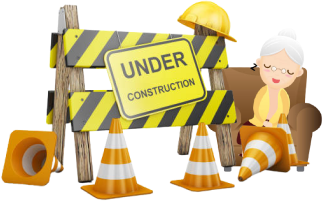

  
  

    
    
    
    
    
    
    
    
    
    
    
    
  

#### About Me

- 💼 Developer at [ANS](https://www.ans.co.uk/)
- 👨‍🏫 Teaching Assistant at [2U](https://2u.com/)
- 💻 Most recent Hack [ETHGlobal Web3Jam - Equatorious](https://showcase.ethglobal.com/web3jam/equatorious)
- 🛠️ Proficiency in [Semantic & Accessible UI](https://www.w3.org/TR/WCAG21/), [React Patterns](https://reactpatterns.com/), Automated Testing and Mentoring
- 🔭 I'm mostly working on private repositories, so you may find scant contributions here
- 👯 I’m looking to collaborate on blockchain projects or anything React
- 💬 Ask me about anything in [Discussions](https://github.com/piouson/piouson/discussions/1)
- 📫 You can reach me on [LinkedIn](https://www.linkedin.com/in/piouson)

  

