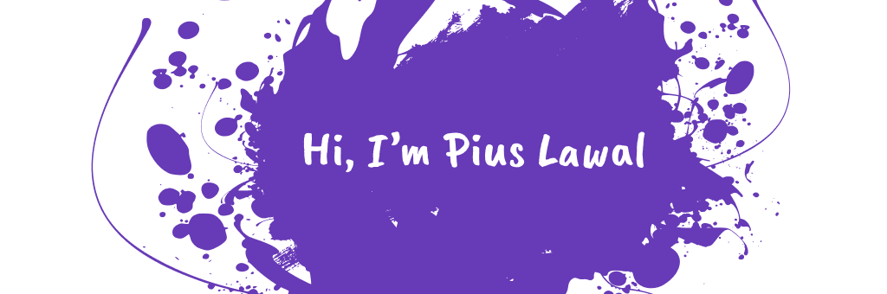

  
  

    
    
    
    
    
    
    
    
    
    
    
    
  

#### About Me

- 💼 Developer at <a alt="ANS Group" href="https://www.ans.co.uk/" target="_blank">ANS</a>
- 👨‍🏫 Teaching Assistant at <a alt="2U Inc" href="https://2u.com/" target="_blank">2U</a>
- 💻 Most recent Hack <a alt="ETH-Global Web3Jam Hackathon project - Equatorious" href="https://showcase.ethglobal.com/web3jam/equatorious" target="_blank">ETHGlobal Web3Jam - Equatorious</a>
- 🛠️ Proficiency in <a alt="Semantic & Accessible UI" href="https://www.w3.org/TR/WCAG21/" target="_blank">Semantic & Accessible UI</a>, <a alt="React Patterns" href="https://reactpatterns.com/" target="_blank">React Patterns</a>, <a alt="Test Automation" href="https://testautomationu.applitools.com/learningpaths.html" target="_blank">Test Automation</a> and Mentoring
- 🔭 I'm mostly working on private repositories, so you may find scant contributions here
- 👯 I’m looking to collaborate on blockchain projects or anything React
- 💬 Ask me about anything in <a alt="GitHub - Discussions" href="https://github.com/piouson/piouson/discussions/1" target="_blank">Discussions</a>
- 📫 You can reach me on <a alt="LinkedIn - Pius Lawal" href="https://www.linkedin.com/in/piouson" target="_blank">LinkedIn</a>

  

